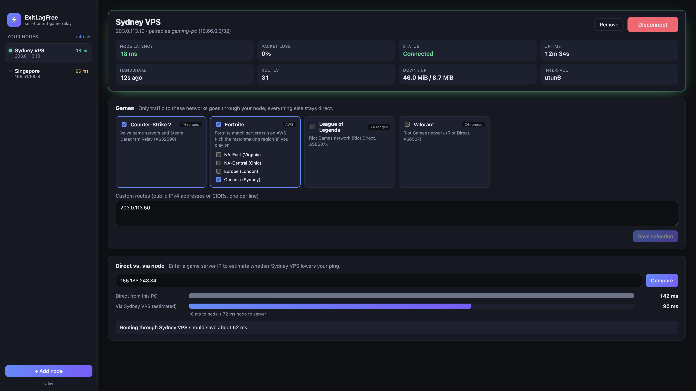

# ExitLagFree

A self-hosted, open alternative to game accelerators like ExitLag. You rent a cheap Linux VPS close to the game servers, turn it into a private relay, and the desktop app (macOS, Windows, Linux) sends only your game traffic through it over WireGuard. Everything else keeps using your normal connection.

**Documentation: [altairca.github.io/ExitLagFree](https://altairca.github.io/ExitLagFree)**



## Quick start

**1. Set up a node** on a Linux VPS (Ubuntu or Debian, amd64 or arm64) near the game servers:

```bash
curl -fsSL https://github.com/AltairCA/ExitLagFree/releases/latest/download/install.sh | sudo bash
```

It prints a one-time `elf://` pairing link. If your provider has a cloud firewall, allow TCP 8443, UDP 51820 and UDP 51821.

Server already running other services, or prefer Docker? See the [manual install](https://altairca.github.io/ExitLagFree/node/manual-install), [servers with existing services](https://altairca.github.io/ExitLagFree/node/existing-services) and [Docker](https://altairca.github.io/ExitLagFree/node/docker) guides.

**2. Install the desktop app** from the [releases page](https://github.com/AltairCA/ExitLagFree/releases), click **Install helper** once, then **+ Add node** and paste the link.

**3. Pick your games and connect.** Built-in profiles cover Counter-Strike 2, Valorant, League of Legends, Fortnite and Apex Legends, and you can add your own IPs or ranges.

## How it works

```
 your PC                                   your VPS                      game servers
┌──────────────────────────┐   WireGuard  ┌───────────────────────┐
│ ExitLagFree app (no root) │   (UDP)      │ exitlag-node          │      NAT
│   │ local socket / pipe   │ ───────────▶ │  wg-elf interface     │ ───────────▶
│ exitlag-helper (service)  │ only game    │  nftables rules       │
│   TUN + game routes       │ IP ranges    │  HTTPS pairing API    │
└──────────────────────────┘              └───────────────────────┘
```

Nodes are invite-only: single-use expiring links, a pinned TLS certificate, per-device WireGuard keys, instant revocation, and firewall rules that stop paired devices from reaching each other, the VPS or private networks. Details in [How it works](https://altairca.github.io/ExitLagFree/guide/how-it-works).

## Development

You need Go 1.27+, and also Node 22+ and the [Wails CLI](https://wails.io) for the desktop app.

```bash
make test          # unit + integration tests (pairing, probe, firewall rules, routing)
make vet           # vet for darwin, linux and windows
make node-linux    # bin/exitlag-node-linux-{amd64,arm64}
make helper        # bin/exitlag-helper for this OS
make app-dev       # wails dev (finds the helper in ./bin)
make app           # production desktop build with the helper bundled
cd docs && npm install && npm run docs:dev   # docs site at localhost:5173
```

| Path | What's there |
|------|--------------|
| `cmd/exitlag-node` | The node daemon and CLI. |
| `cmd/exitlag-helper` | The privileged client service. |
| `internal/node/...` | Node internals: store, HTTPS API, admin socket, WireGuard, firewall. |
| `internal/client/...` | Client internals: tunnel, IPC, helper, elevation, secrets, node API client, and the app core. |
| `internal/probe` | The authenticated UDP latency probe. |
| `internal/proto` | Shared API types and pairing links. |
| `profiles/` | Game profiles and the route resolver. |
| `app/` | The Wails desktop app (a separate Go module). |
| `docs/` | The VitePress documentation site. |
| `deploy/`, `Dockerfile` | Docker image and compose example for the node. |
| `scripts/` | `install.sh` (VPS installer), Docker entrypoint and Linux packaging. |

### Builds and releases

| Workflow | Trigger | What it does |
|----------|---------|--------------|
| [`build.yml`](.github/workflows/build.yml) | push to `master` | Builds everything, replaces the [Nightly](https://github.com/AltairCA/ExitLagFree/releases/tag/nightly) pre-release, attaches artifacts to the run, pushes `ghcr.io/altairca/exitlagfree-node:nightly` |
| [`release.yml`](.github/workflows/release.yml) | push a `v*` tag | Publishes the release and pushes the image tags `vX.Y.Z` and `latest` |
| [`docs.yml`](.github/workflows/docs.yml) | push to `master` touching `docs/` | Deploys the docs to GitHub Pages |
| [`ci.yml`](.github/workflows/ci.yml) | pull requests, push to `master` | Tests, vet, frontend build |

After the first image push, make the `exitlagfree-node` package public once under the repository's **Packages** settings so anyone can pull it.
